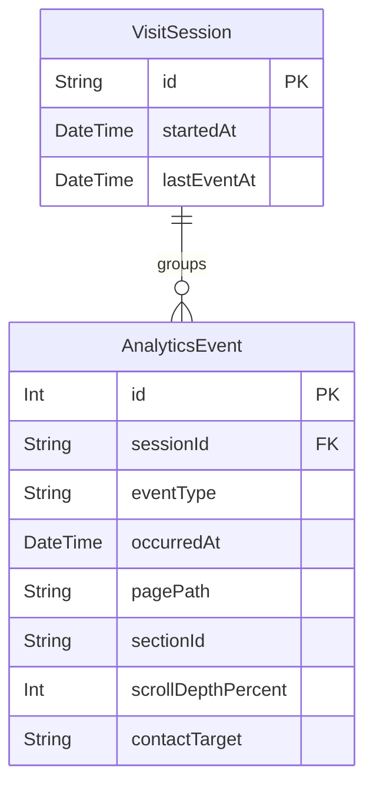

# Data Model Documentation

This document describes the data model for CareerDNA (see [PRD](./PRD.md), v1.1), including entity descriptions, field definitions, relationships, and an entity-relationship diagram.

The scope is deliberately minimal. Per PRD §6 and §8, all profile content (chapters, projects, skills, FAQ) lives in version-controlled structured files and **never** in the database. The database exists for exactly one purpose: persisting **anonymized visitor engagement events** (F8) and serving the **owner-only admin insights dashboard** (F9).

## Scope

### In scope

- Anonymized analytics events (page views, section reach/scroll depth, chat opens, question counts, résumé downloads, contact clicks)
- Session-level grouping of events to support engagement metrics (PRD §10: median session duration, share of visitors reaching the second career chapter)

### Explicitly excluded

- **Profile content** — chapters, projects, skills, FAQ live in `/content` files (PRD §6)
- **Chat conversations** — never persisted server-side; question events store a count, never content (PRD §5 F8, §9)
- **Visitor accounts or identity** — no users table, no emails, no names (PRD §5 F9, §9)
- **PII of any kind** — no raw IP addresses, no fingerprints, no free-text visitor input (PRD §5 F8)
- **The former LTI entity model** (candidates, positions, applications, interviews) — removed; it described an earlier multi-user framework concept that is out of scope (PRD §2)

## Model Descriptions

### 1. VisitSession

Groups the events of a single anonymous visit so that engagement metrics (session duration, story depth) can be computed. Contains nothing that identifies the visitor.

**Fields:**

- `id`: Opaque, non-identifying session identifier (Primary Key)
- `startedAt`: Timestamp of the first event in the session
- `lastEventAt`: Timestamp of the most recent event in the session

**Derived metrics (computed, not stored):**

- Session duration (`lastEventAt − startedAt`)
- Deepest section/chapter reached (from related `section_reach` events)

**Validation Rules:**

- `id` must be an opaque random value; it must not be derived from IP address, user agent, or any fingerprinting technique (PRD §5 F8)
- **TBD:** session attribution mechanism — must work without cookies and without fingerprinting; open question pending decision

**Relationships:**

- `events`: One-to-many relationship with AnalyticsEvent

### 2. AnalyticsEvent

A single anonymized engagement event. This is the only fact table in the system; every F8 metric and every F9 dashboard report derives from it.

**Fields:**

- `id`: Unique identifier for the event (Primary Key)
- `sessionId`: Foreign key referencing VisitSession
- `eventType`: Type of event (enum, see below)
- `occurredAt`: Timestamp of the event
- `pagePath`: Path of the page where the event occurred
- `sectionId`: Site section/chapter anchor involved (optional; required for `section_reach`)
- `scrollDepthPercent`: Scroll depth milestone reached (optional; only for `section_reach`, integer 0–100)
- `contactTarget`: Contact channel clicked (optional; only for `contact_click`; one of `scheduling`, `email`, `linkedin`, per PRD §5 F7)
- **TBD dimensions** (pending decision on allowed non-identifying attributes): `countryOrRegion`, `referrerDomain`, `deviceClass`

**Event types (`eventType` enum, mirroring PRD §5 F8):**

| Value | Meaning |
|---|---|
| `page_view` | A page was viewed |
| `section_reach` | A section/chapter entered view (carries `sectionId`, `scrollDepthPercent`) |
| `chat_open` | The "Ask about Jose" widget was opened |
| `question_asked` | A chat question was submitted — **count only, never content** |
| `resume_download` | The résumé PDF was downloaded |
| `contact_click` | A contact CTA was clicked (carries `contactTarget`) |

**Validation Rules:**

- `eventType` must be one of the enum values above; unknown types are rejected
- `question_asked` events must not carry any message text — the schema deliberately has no field for it
- No field may contain a raw IP address, user agent string, or free-text visitor input (PRD §5 F8 no-PII rule)
- `occurredAt` is required and set server-side
- `sectionId` is required when `eventType` is `section_reach`; `contactTarget` is required when `eventType` is `contact_click`

**Relationships:**

- `session`: Many-to-one relationship with VisitSession

## Entity Relationship Diagram

## Key Design Principles

1. **Anonymity by schema**: The model makes PII collection structurally impossible — there are no fields for identity, message content, or raw network data. Compliance is enforced by design, not by policy.

2. **Single fact table**: All F8 metrics and F9 dashboard reports are aggregations over `AnalyticsEvent`. In the MVP, aggregation happens at query time; rollup tables are added only if dashboard performance requires them.

3. **Content stays in files**: The database never stores profile content. The content files in `/content` remain the single source of truth for the site and the chatbot (PRD §6).

4. **Owner access without a users table**: The admin dashboard (F9) is restricted to the single owner. The access mechanism is TBD (open question) but is not expected to require database entities; if the chosen mechanism needs persistence, this document must be updated first.

## Open Items (TBD)

These are recorded open questions from the PRD v1.1 review; the model must be revisited when they are decided:

1. **Allowed dimensions** — which non-identifying attributes (`countryOrRegion`, `referrerDomain`, `deviceClass`) are captured on events
2. **Retention period** — how long events are kept before deletion or aggregation (PRD §9 marks this TBD)
3. **Database choice** — lightweight managed store, selection pending (PRD §8)
4. **Session attribution mechanism** — must remain cookieless and fingerprint-free
5. **Analytics topology** — whether a third-party cookieless provider runs alongside this first-party store

## Notes

- All `id` fields serve as primary keys; `AnalyticsEvent.id` is auto-incrementing, `VisitSession.id` is an opaque random value
- The foreign key from AnalyticsEvent to VisitSession maintains referential integrity
- Timestamps are stored in UTC
